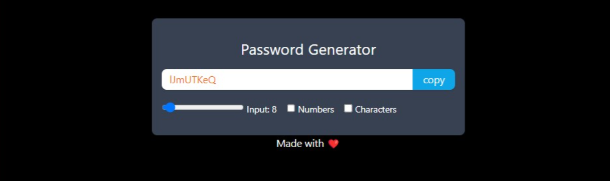

# Password Generator

Welcome to the Password Generator project! This React application, built with Vite and styled using Tailwind CSS, allows you to generate secure passwords with various options.



## Features

1. **Password Length Range:** Select a password length from 6 to 50 characters.
2. **Include Numeric Values:** Choose to include numeric values in your generated password for added complexity.
3. **Include Special Characters:** Optionally include special characters to make your password even more secure.

## Usage

1. **Clone the Repository**

   ```bash
   git clone https://github.com/bhupender0415/React_Project.git
   ```
2. **Navigate to the Project Directory**

   ```bash
   cd React_Project/05passwardGenerator
   ```
3. **Install Dependencies**

   ```bash
   npm install
   ```
4. **Start the Development Server**

   ```bash
   npm run dev
   ```

   This will start the development server, and you can access the app in your browser at `http://localhost:3000`.
5. **Generate Passwords**

   - Use the sliders to select the desired password length.
   - Toggle the "Include Numeric Values" and "Include Special Characters" options as needed.
   - Click the "Generate Password" button to create a secure password.
6. **Copy Password to Clipboard**

   - Once a password is generated, you can click the "Copy to Clipboard" button to easily copy it for use.
7. **Enjoy Secure Passwords!**

   Use the generated passwords for your accounts, and ensure the security of your online accounts.

## Customize

You can customize the appearance and behavior of the Password Generator by modifying the React components and Tailwind CSS styles according to your preferences.

## Contributing

We welcome contributions! If you'd like to contribute to the Password Generator, please follow our [contribution guidelines](CONTRIBUTING.md).

## License

This project is licensed under the MIT License - see the [LICENSE](LICENSE) file for details.

```

You can copy and paste this entire Markdown content into a single .md file in your project, which will serve as your README.md file. Make sure to save the file with the .md extension, and it will provide all the necessary information about your Password Generator project.
```
